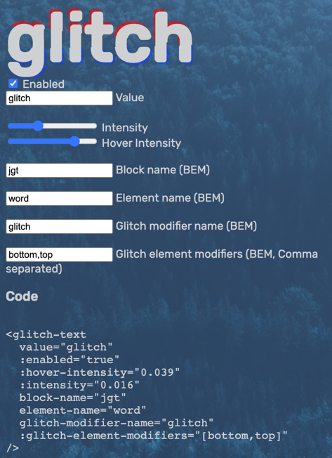
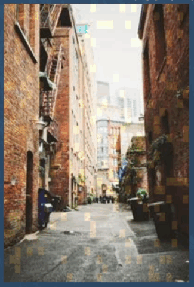

# Introduction
Add glitch effects to your project

Notice that I just started this project. More info will be reflected here soon. Project is not ready for use in production environments.

## Requirements
- vue ^3.2.26
- node-sass" ^4.12.0 
- typescript ^4.5.4

## Installation
Install it via ```npm install jglitch```

## Implementation
You can choose to install components [globally](https://v3.vuejs.org/guide/component-registration.html#global-registration) or [locally](https://v3.vuejs.org/guide/component-registration.html#local-registration).
### Global installation
This chapter explains how to make all glitch components available for all of your components.\
\
In your main typescript script you import it like this:
```ts
import jglitch from "jglitch"; //Add this
const app = createApp(App); //You should have a line like this already
app.use(jglitch); // Add this.
```
In your sass file you can import the styles for all components at once like this:
```scss
@import "~jglitch/src/style";
```

### Local installation
This chapter explains how to make the glitch components available only in the components you want to use them.
First open the component in which you'd like to have a glitch component. Then import it just below the opening ```<script>``` tag like this for exmaple:
```ts
import { glitchTextController, glitchText } from "jglitch"
```
Then in your main scss file or component style tag (with lang=scss) you'd import the styles for the components:
```scss
@import "~jglitch/src/style/text/text";
@import "~jglitch/src/style/glitch_text_controller/glitch_text_controller";
```

## Usage
### Text glitch
Shows a text that has a broken, shaky look.\


Add this to your vue component's template to show a glitching text:

```js
<glitch-text value="glitch"/>
```
The value will be the text that is shown.

#### Properties
You can pass in props to the component. Here is a list of them:

| Property                 | Decription                                                                                                  | Type     | Required | Default           |
|--------------------------|-------------------------------------------------------------------------------------------------------------|----------|----------|-------------------|
| value                    | The text to display                                                                                         | String   | yes      | n/a               |
| enabled                  | Enables the glitch effect or not                                                                            | Boolean  | no       | true              |
| intensity                | How intense the glitch shakes in em's. Overrides css variable "--intensity" Recommended range: 0.001 - 0.05 | Number   | no       | n/a               |
| hover-intensity          | How intense the glitch shakes in em's when hovering over it. Overrides css variable "--hover-intensity"     | Number   | no       | n/a               |
| block-name               | Them block part of the BEM class names that will be used.                                                   | String   | no       | "jgt"             |
| element-name             | The element part of the BEM class names that will be used.                                                  | String   | no       | "word"            |
| glitch-modifier-name     | The modifier part that of the BEM class names that will be used, when "enabled" property is true            | String   | no       | "glitch"          |
| glitch-element-modifiers | The modifier parts of the BEM class names that will be used on the span elements that emphasize the glitch  | String[] | no       | ["bottom", "top"] |

### Text glitch controller
Shows a glitch text with a controller to help you find the correct code to implement it. it is meant for development purposes only:\


Add this to your vue component's template to show the controller:
```js
<glitch-text-controller/>
```

### Image glitch
Gives an image a broken look. It can do that in different ways. This is an example of the "blocks" mode:\


#### Properties
You can pass in props to the component. Here is a list of them:

| Property             | Decription                                                                                                  | Type    | Required | Default     |
|----------------------|-------------------------------------------------------------------------------------------------------------|---------|----------|-------------|
| src                  | The src to an image. When on another origin, you must setup cors correctly to prevent tainted canvases.     | String  | yes      | n/a         |
| enabled              | Enables the glitch effect or not                                                                            | Boolean | no       | true        |
| block-name           | Them block part of the BEM class names that will be used.                                                   | String  | no       | "jgi-image" |
| element-name         | The element part of the BEM class names that will be used for the actual img tag and canvas tag.            | String  | no       | "picture"   |
| hidden-modifier-name | The modifier part of the BEM class names that will be used on the img and canvas to hide them in some cases | String  | no       | "hidden"    |
| mode                 | The name of the mode. it determines HOW it should glitch the image. See the options below this table        | String  | no       | "blocks"    |
| options              | Configuration options to configure the mode. More info beneath this table                                   | Object  | no       | null        |

#### Blocks mode
The blocks mode puts fading blocks on the image. These are its options:

| Property    | Description                                                                                                     | Type   | Default |
|-------------|-----------------------------------------------------------------------------------------------------------------|--------|---------|
| blockSizeX  | The width of the block. 1 means that it is the same width as the image. 2 means 50% of the image width. Etc.    | Number | 32      |
| blockSizeY  | The height of the block. 1 means that it is the same height as the image. 2 means 50% of the image height. Etc. | Number | 32      |
| minDuration | The minimum duration that a block is visible in milliseconds.                                                   | Number | 100     |
| maxDuration | The maximum duration that a block is visible in milliseconds.                                                   | Number | 200     |
| intensity   | How much the pixels should brighten or darken per frame. It's like the opacity but can be bigger then 1         | Number | 1       |

## Customization
You can customize the components to your likings by importing specific sass files and override others. 
Just open one of the pre-made ones to see / determine what's imported, and what you want to override. You'll find them in the directory
```~jglitch/src/style/```. Remember, the tilde `~`refers to the ```node_modules``` folder.\
\
Example: Maybe you want to edit the default glitching red and blue colors of the [Glitch text component](#text-glitch). For that you need to
have a look at its sass file ```~jglitch/src/style/text/text``` to discover that it imports a ```variables``` sass file in which
the colors are configured. So to customize them you'll could do it like this:
1. In your projects sass file, you'll first need to configure the variables you'd want to override.
2. Then you'll need to import the components sass file ```~jglitch/src/style/text/text```. It could look like this.

```scss
//Your projects other sass code here
$jgt-top-glitch-color: #5157dc;
$jgt-bottom-glitch-color: #3ea630;
@import "~jglitch/src/style/text/text";
```
Feel free to import stuff or leave it out if you want to customize it yourself. It's up to you.

## Known issues
### Text glitch component
#### Safari @keyframes problem / bug
Safari 15.1, probable earlier versions too, do not update css variables / custom properties inside of @keyframes css statements when they change.
The forceUpdateKey in text.vue does solve this issue a little. Each time you change the ```intensity``` or ```hover-intensity```
props on the vue component, the component is forced to be redrawn completely. Because this causes the forceUpdateKey variable to update.
This causes the template to be redrawn. And that fixes the issue when updating ```intensity``` or ```hover-intensity``` props.\
\
When you hover over the glitch text component, the ```intensity``` property is updated via a css pseudo :hover class. Because of this, we cannot update the forceUpdateKey
inside the component.\
\
When you only pass in the props once, and don't change them afterwards, there should not be an issue at all.
